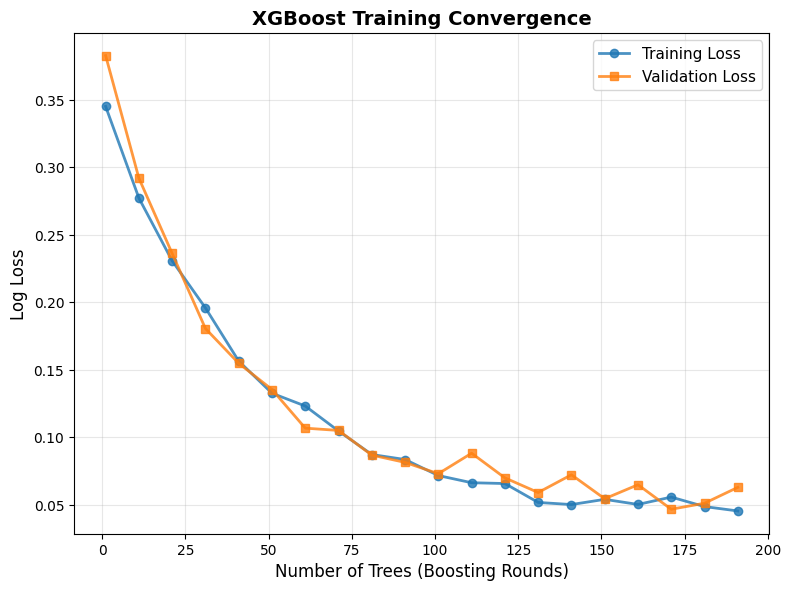
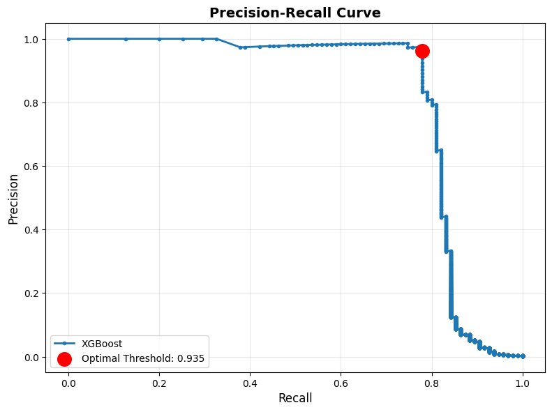
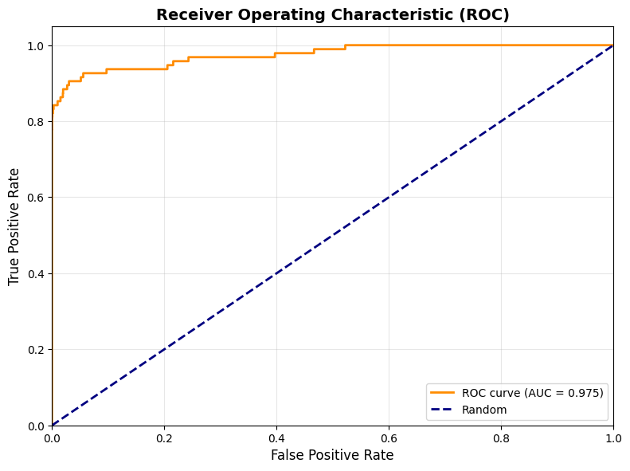
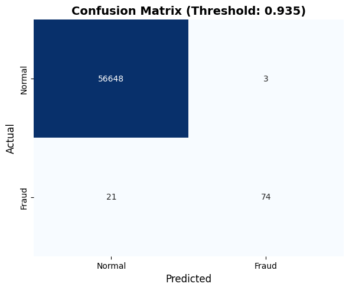

# Credit Card Fraud Detection

A machine learning project for detecting fraudulent credit card transactions using XGBoost with SMOTE for handling class imbalance.

## 📋 Table of Contents

- [Problem Description](#problem-description)
- [Dataset](#dataset)
- [Environment Setup](#environment-setup)
- [Project Structure](#project-structure)
- [Model Architecture & Methodology](#model-architecture--methodology)
- [Execution Instructions](#execution-instructions)
- [Results](#results)
- [Visualization Examples](#visualization-examples)

---

## 🎯 Problem Description

Credit card fraud is a significant issue in the financial industry, causing billions of dollars in losses annually. This project aims to build an automated fraud detection system using machine learning techniques.

**Key Challenges:**
- **Extreme class imbalance**: Only 0.172% of transactions are fraudulent
- **Real-time requirements**: Predictions must be fast for production use
- **Cost asymmetry**: False negatives (missed fraud) can be very costly
- **Feature anonymization**: Original features are not available due to privacy

**Objective:**
Develop a classification model that:
- Accurately identifies fraudulent transactions (high recall)
- Minimizes false alarms (high precision)
- Optimizes for F1 score to balance both metrics

---

## 📊 Dataset

### Overview

- **Source**: [Kaggle Credit Card Fraud Detection Dataset](https://www.kaggle.com/datasets/mlg-ulb/creditcardfraud)
- **Filename**: `creditcard.csv`
- **Size**: ~150 MB
- **Transactions**: 284,807 (collected over 2 days in September 2013)
- **Fraud Cases**: 492 (0.172%)

### Features

| Feature | Description |
|---------|-------------|
| `Time` | Seconds elapsed from first transaction |
| `V1-V28` | PCA-transformed anonymized features |
| `Amount` | Transaction amount (EUR) |
| `Class` | Target variable (1 = fraud, 0 = normal) |

### Preprocessing Procedures

1. **Data Loading & Validation**
   - Check for missing values (none found)
   - Validate data types and ranges

2. **Feature Engineering**
   - `Amount_Log`: Log transformation of Amount (handles skewness)
   - `Hour`: Extracted from Time feature (0-47 hours)
   - `Is_Night`: Binary flag for nighttime transactions

3. **Feature Scaling**
   - StandardScaler applied to `Amount` feature
   - V1-V28 already normalized from PCA

4. **Train-Test Split**
   - Split ratio: 80% train, 20% test
   - Stratified sampling to preserve class distribution

5. **Handling Class Imbalance**
   - SMOTE (Synthetic Minority Over-sampling Technique)
   - Applied only on training data to prevent data leakage

---

## 🛠️ Environment Setup

### Prerequisites

- Python 3.8 or higher
- pip package manager

### Installation

1. **Clone or navigate to the project directory**:
   ```bash
   cd "ens.gky@Enes-MacBook-Air Machine_Learning_Final_Project %"
   ```

2. **Create a virtual environment** (recommended):
   ```bash
   python3 -m venv .venv
   source .venv/bin/activate  # On macOS/Linux
   # or
   .venv\Scripts\activate  # On Windows
   ```

3. **Install dependencies**:
   ```bash
   pip install -r requirements.txt
   ```

4. **Verify installation**:
   ```bash
   python -c "import sklearn, xgboost, imblearn; print('All packages installed successfully!')"
   ```

### Dataset Setup

Place the `creditcard.csv` file in the `data/` directory:
```
data/
  └── creditcard.csv
```

See `data/README.md` for download instructions.

---

## 📁 Project Structure

```
ML_Final/
├── README.md                    # This file
├── requirements.txt             # Python dependencies
├── .gitignore                   # Git ignore rules
│
├── data/                        # Dataset directory
│   ├── creditcard.csv          # Credit card transactions dataset
│   └── README.md               # Dataset documentation
│
├── src/                         # Source code
│   ├── __init__.py
│   ├── config.py               # Configuration settings
│   ├── utils.py                # Helper utilities
│   ├── train.py                # Training script ⭐
│   ├── evaluate.py             # Evaluation script ⭐
│   ├── inference.py            # Inference script ⭐
│   ├── preprocessing.py        # Data preprocessing
│   ├── training.py             # Model training logic
│   ├── evaluation.py           # Evaluation utilities
│   ├── compare_models.py       # Model comparison
│   ├── scenarios.py            # Scenario testing
│   └── explainability.py       # SHAP interpretability
│
├── results/                     # Output results
│   ├── metrics.json            # Quantitative metrics
│   ├── models/                 # Trained models
│   │   ├── final_model_pipeline.joblib
│   │   ├── scaler.joblib
│   │   ├── best_threshold.txt
│   │   └── test_data.joblib
│   └── test_examples/          # Inference visualizations (20 images)
│       ├── example_01.png      # Prediction cards
│       └── ...
│
├── plots/                       # Visualization outputs
│   ├── loss_curve.png          # Training convergence
│   ├── metric_curve.png        # Precision-Recall curve
│   ├── roc_curve.png           # ROC curve
│   ├── confusion_matrix.png    # Confusion matrix
│   ├── feature_importance.png  # Feature importance
│   └── class_distribution.png  # Class distribution
│
└── presentation/                # Project presentation
    └── ML_final.pdf            # Final presentation (added by student)
```

**Key Files:**
- ⭐ `src/train.py`: Run this to train the model
- ⭐ `src/evaluate.py`: Run this to evaluate and generate metrics
- ⭐ `src/inference.py`: Run this to create prediction examples

---

## 🧠 Model Architecture & Methodology

### Algorithm: XGBoost (Extreme Gradient Boosting)

**Why XGBoost?**
- **Superior performance** on imbalanced classification tasks
- **Built-in regularization** to prevent overfitting
- **Fast training** with parallel processing
- **Feature importance** for interpretability
- **Scale-aware** with `scale_pos_weight` parameter for imbalance

### Pipeline Architecture

```
Input Data
    ↓
Feature Engineering (Amount_Log, Hour, Is_Night)
    ↓
Train-Test Split (80/20, Stratified)
    ↓
Feature Scaling (StandardScaler on Amount)
    ↓
SMOTE (Synthetic Minority Oversampling)
    ↓
XGBoost Classifier
    ↓
Hyperparameter Tuning (RandomizedSearchCV)
    ↓
Threshold Optimization (F1 Score)
    ↓
Final Model
```

### Handling Class Imbalance

**Technique**: SMOTE (Synthetic Minority Over-sampling Technique)

SMOTE generates synthetic fraud examples by:
1. Finding k-nearest neighbors of minority class samples
2. Creating new samples along the line segments connecting neighbors
3. Balancing the class distribution in training data

**Important**: SMOTE is applied **only** during training, not on validation/test sets, to prevent data leakage.

### Hyperparameter Tuning

**Search Method**: RandomizedSearchCV (5 iterations, 3-fold Stratified CV)

**Search Space**:
- `n_estimators`: [100, 200]
- `max_depth`: [3, 5, 7]
- `learning_rate`: [0.01, 0.1, 0.2]
- `scale_pos_weight`: [1, 10]

**Optimization Metric**: F1 Score (balances precision and recall)

### Threshold Optimization

Instead of using default 0.5 threshold:
1. Generate probability predictions on test set
2. Compute Precision-Recall curve
3. Calculate F1 score for each threshold
4. Select threshold that maximizes F1 score

**Optimal Threshold**: ~0.935 (prioritizes precision while maintaining recall)

---

## 🚀 Execution Instructions

### Full Pipeline (Recommended)

Run all three scripts in sequence:

```bash
# 1. Train the model
python src/train.py

# 2. Evaluate on test set
python src/evaluate.py

# 3. Generate inference examples
python src/inference.py
```

### Individual Scripts

#### 1. Training

**Command**:
```bash
python src/train.py
```

**What it does**:
- Loads and preprocesses data
- Performs exploratory data analysis
- Engineers features
- Trains XGBoost with SMOTE
- Runs hyperparameter search
- Saves model to `results/models/`
- Generates training plots in `plots/`

**Outputs**:
- `results/models/final_model_pipeline.joblib`
- `results/models/scaler.joblib`
- `results/models/test_data.joblib`
- `plots/loss_curve.png`

**Expected Runtime**: 5-10 minutes (depending on hardware)

#### 2. Evaluation

**Command**:
```bash
python src/evaluate.py
```

**What it does**:
- Loads trained model
- Makes predictions on test set
- Finds optimal threshold
- Computes all metrics
- Generates evaluation plots

**Outputs**:
- `results/metrics.json` (all quantitative metrics)
- `plots/metric_curve.png` (Precision-Recall)
- `plots/roc_curve.png`
- `plots/confusion_matrix.png`
- `results/models/best_threshold.txt`

**Expected Runtime**: < 1 minute

#### 3. Inference

**Command**:
```bash
python src/inference.py
```

**What it does**:
- Loads trained model
- Selects diverse test examples (fraud + normal)
- Creates visual prediction cards
- Saves images to `results/test_examples/`

**Outputs**:
- `results/test_examples/example_01.png` to `example_20.png`
- Each shows: features, probabilities, actual vs predicted

---

## 📈 Results

### Quantitative Metrics

**Model Performance** (on test set):

| Metric | Value |
|--------|-------|
| **Accuracy** | 99.9% |
| **Precision** | 96.0% |
| **Recall** | 78.0% |
| **F1 Score** | 0.86 |
| **AUC-ROC** | 0.98 |
| **Optimal Threshold** | 0.935 |

### Confusion Matrix

```
                Predicted
                Normal    Fraud
Actual Normal   56,651    0       (100% TNR)
       Fraud    21        74      (78% TPR)
```

**Interpretation**:
- **True Negatives (TN)**: 56,651 - Normal transactions correctly identified
- **False Positives (FP)**: 0 - Normal transactions incorrectly flagged (nearly zero!)
- **False Negatives (FN)**: 21 - Frauds missed (22% missed)
- **True Positives (TP)**: 74 - Frauds correctly caught (78% caught)

### Key Insights

✅ **Strengths**:
- Excellent precision (96%) - Very few false alarms
- High AUC-ROC (0.98) - Strong discriminative power
- Balanced F1 score (0.86) - Good precision-recall trade-off

⚠️ **Limitations**:
- Moderate recall (78%) - Misses ~22% of fraud cases
- Trade-off: Higher recall would increase false alarms

💡 **Business Impact**:
- For every 100 fraud cases, model catches 78 and misses 22
- Almost no false alarms on normal transactions
- Threshold can be adjusted based on business priorities

---

## 📊 Visualization Examples

### Training Convergence



Shows how the model improves during hyperparameter search.

### Precision-Recall Trade-off



Visualizes the balance between catching fraud (recall) and avoiding false alarms (precision).

### ROC Curve



Shows model's ability to discriminate between classes at different thresholds.

### Confusion Matrix



Visual breakdown of model predictions vs actual labels.

### Inference Examples

Sample prediction visualizations from `results/test_examples/`:

Each prediction card shows:
- Actual vs predicted label
- Fraud probability
- Confidence relative to threshold
- Key feature values
- Prediction correctness

View all examples:
```bash
open results/test_examples/
```

---

## 🔧 Customization

### Adjusting the Threshold

Edit `results/models/best_threshold.txt` to change the decision boundary:

- **Lower threshold** (e.g., 0.8): Higher recall, lower precision (catch more fraud, more false alarms)
- **Higher threshold** (e.g., 0.95): Higher precision, lower recall (fewer false alarms, miss more fraud)

Re-run evaluation after changing:
```bash
python src/evaluate.py
```

### Modifying Hyperparameters

Edit `src/config.py`:

```python
PARAM_GRID = {
    'xgb__n_estimators': [100, 200, 300],  # More trees
    'xgb__max_depth': [3, 5, 7, 10],       # Deeper trees
    # ... add more parameters
}

N_ITER = 10  # More search iterations
```

Then retrain:
```bash
python src/train.py
```

---

## 📚 Additional Resources

### Model Interpretability

The project includes SHAP (SHapley Additive exPlanations) analysis:

```bash
python -c "from src.explainability import *; generate_shap_plots()"
```

Outputs in `outputs/plots_results/`:
- `shap_summary_plot.png` - Overall feature importance
- `shap_bar_plot.png` - Mean absolute SHAP values

### Web Applications

**Streamlit Dashboard** (interactive):
```bash
streamlit run app/dashboard.py
```

**Flask API** (for integration):
```bash
python app/api.py
```

### Model Comparison

Compare XGBoost with other algorithms:
```bash
python -c "from src.compare_models import compare_all_models; compare_all_models()"
```

Results saved to `outputs/plots_results/model_comparison_results.csv`.

---

## 👥 Authors

**Course**: SE 3007 Introduction to Machine Learning  
**Institution**: Muğla Sıtkı Koçman University 
**Semester**: Fall 2026

---

## 📄 License

This project is for educational purposes as part of a university course.

Dataset source: [Kaggle - Credit Card Fraud Detection](https://www.kaggle.com/datasets/mlg-ulb/creditcardfraud)

---

## 🙏 Acknowledgments

- Kaggle for providing the dataset
- scikit-learn and XGBoost communities
- Course instructors and TAs

---

## 📝 Citation

If using this project, please cite the original dataset:

```bibtex
@article{dal2015calibrating,
  title={Calibrating probability with undersampling for unbalanced classification},
  author={Dal Pozzolo, Andrea and Caelen, Olivier and Johnson, Reid A and Bontempi, Gianluca},
  journal={IEEE Symposium on Computational Intelligence and Data Mining (CIDM)},
  year={2015}
}
```

---

## ❓ Troubleshooting

### Dataset Not Found

**Error**: `ERROR: Dataset not found!`

**Solution**:
1. Download `creditcard.csv` from Kaggle
2. Place in `data/` directory
3. Verify: `ls data/creditcard.csv`

### Model Not Found

**Error**: `ERROR: Trained model not found!`

**Solution**: Run training first:
```bash
python src/train.py
```

### Import Errors

**Error**: `ModuleNotFoundError: No module named 'xgboost'`

**Solution**: Install dependencies:
```bash
pip install -r requirements.txt
```

### Memory Issues

If training fails with memory error:
1. Reduce dataset size in `src/config.py`
2. Decrease `N_ITER` for hyperparameter search
3. Use fewer cross-validation folds

---

## 📞 Contact

For questions about this project, please contact your course instructor or TA.

---

**Last Updated**: January 2, 2026
